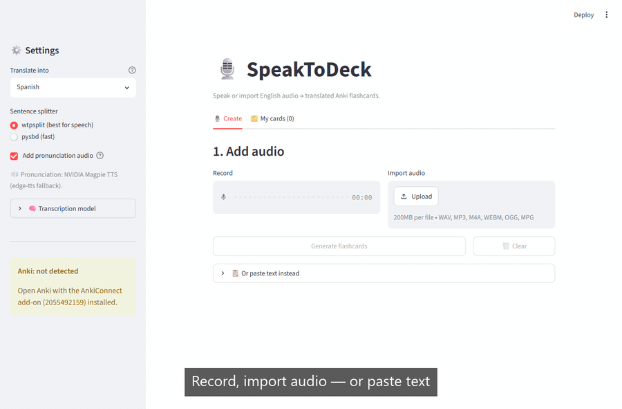
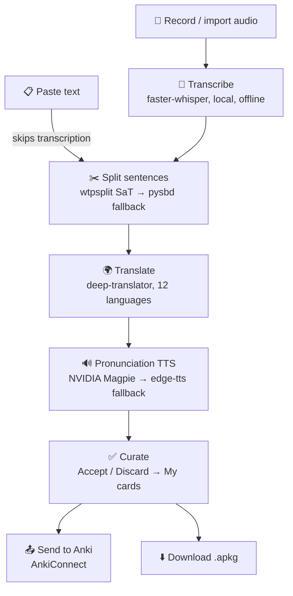

# 🎙️ SpeakToDeck

**Turn spoken English audio or text into translated Anki flashcards, free with local tooling.**

Record or import audio (or just paste text), and SpeakToDeck transcribes it, splits it
into sentences, translates each into a language you choose, adds native pronunciation
audio, lets you accept/discard candidates, then pushes the deck straight into your open
Anki app.

**[▶️ Try the live demo](https://speaktodeck.streamlit.app)**, hosted on Streamlit Cloud
(transcription via Groq, capped at 5 clips/day; pronunciation audio and Send-to-Anki need
a local run; grab your deck with ⬇️ Download .apkg).





---

## ✨ Features

- 🎙️ **Record or import** : audio (WAV, MP3, M4A, WebM, OGG).
- 📋 **Paste text** : a text box that skips transcription and feeds to the pipeline
- 🗣️ **Offline transcription** : faster-whisper; switch the Whisper model and compute
  type live from the sidebar.
- ✂️ **Sentence splitting** : wtpsplit SaT, with a pysbd fallback.
- 🌍 **Translate into 12 languages** : switch language anytime and cards re-translate in
  place, keeping your accept/discard choices.
- 🔊 **Pronunciation audio** for every card: NVIDIA Magpie TTS (7 languages), with a free
  edge-tts fallback covering all 12.
- ✅ **Curate** candidates with Accept / Discard, then review them in a **My cards** tab.
- 📤 **Send to Anki** live via AnkiConnect, or download a self-contained `.apkg`.

---

## 🧰 Tech stack

| Stage | Tooling |
| --- | --- |
| UI | [Streamlit](https://streamlit.io/) |
| Transcription | [faster-whisper](https://github.com/SYSTRAN/faster-whisper) (Whisper, local) + [ffmpeg](https://ffmpeg.org/) for decoding |
| Sentence splitting | [wtpsplit](https://github.com/segment-any-text/wtpsplit) (SaT) / [pysbd](https://github.com/nipunsadvilkar/pySBD) |
| Translation | [deep-translator](https://github.com/nidhaloff/deep-translator) (Google free endpoint) |
| Pronunciation TTS | [NVIDIA Magpie multilingual](https://build.nvidia.com/nvidia/magpie-tts-multilingual) (Riva gRPC, `nvidia-riva-client`) → [edge-tts](https://github.com/rany2/edge-tts) fallback |
| Flashcards / Anki | [AnkiConnect](https://foosoft.net/projects/anki-connect/) (live) · [genanki](https://github.com/kerrickstaley/genanki) (`.apkg` export) |
| Config / secrets | [python-dotenv](https://github.com/theskumar/python-dotenv) |
| Tests | [pytest](https://docs.pytest.org/) |

---

## 🛠️ How I built it (the process)

I'd been spending a lot of time studying languages on Anki, then came across a YouTube
video arguing you should personalize your flashcards around what you actually talk about
day-to-day because that's what you end up saying anyway. That idea is what kicked off
SpeakToDeck.

I built the pipeline first, which was also the hardest part. I wanted it **local and
free**, so I researched and stitched together free, working services for each stage, then
wrapped the whole thing in a Streamlit dashboard. The trickiest piece was tuning the
Whisper model to transcribe speech accurately (large-v3-turbo) turned out to be the
right pick. Two principles held throughout: **local & free first**, and **fallback-first**
so no external dependency is a hard failure (SaT → pysbd, NVIDIA → edge-tts, AnkiConnect →
`.apkg`).

---

## 📚 What I learned

- **Streamlit reruns the whole script on every interaction**, so the real work is caching
  the right things (`session_state` for transcripts/candidates, `@lru_cache` for models).
- **Out-of-the-box Whisper needs tuning for speech**: VAD, a punctuated priming prompt,
  and cross-segment context made a big difference.
- **Design for graceful degradation**: treating every network call as fallible and
  degrading per-item, not per-run, made the app far more robust.
- **Keep orchestration thin**: pushing logic into modules made the pipeline easy to test
  offline.

---

## 🚀 How it could be improved

- **Cut button latency.** Every click reruns the whole Streamlit script, the main source
  of lag. Wrapping curation in **`st.fragment`** so only that region re-runs would make it
  feel near-instant.
- **Cache TTS & translation** by `(text, language)`, so switching language or voice is
  instant instead of re-processing everything.
- **GPU & offline backends.** GPU compute types (e.g. `float16`) for faster Whisper, and
  [`argostranslate`](https://github.com/argosopentech/argos-translate) as a fully-offline
  translation fallback.

---

## ▶️ How to run the project

### 1. Install Python deps
```powershell
pip install -r requirements.txt
```

### 2. Install ffmpeg (Whisper needs it to decode non-WAV uploads)
```powershell
winget install Gyan.FFmpeg
```
Confirm with `ffmpeg -version`.

### 3. Run it
```powershell
streamlit run app.py
```
Opens at <http://localhost:8501>.

### 4. Use it
1. **⚙️ Settings** (sidebar): pick the language, splitter, TTS toggle, and (under **🧠
   Transcription model**) the Whisper model and compute type.
2. **🎙️ Create** tab → **Add audio**: **Record** or **Import** a file, or open
   **📋 Or paste text** and paste any English text (skips transcription).
3. **Generate flashcards** (or **Generate from text**) to run the pipeline and list
   candidates.
4. **✅ Accept** / **❌ Discard** each candidate (accepted ones move to **My cards**).
5. **🗂️ My cards**: review with audio, **↩️ Remove** any you reconsider, name the deck,
   then **📤 Send to Anki** (or download the `.apkg`).

<details>
<summary><b>Send to Anki: set up AnkiConnect</b></summary>

1. Install [Anki desktop](https://apps.ankiweb.net/).
2. In Anki: **Tools → Add-ons → Get Add-ons…** and enter code **`2055492159`**.
3. Restart Anki and keep it open. Visiting <http://localhost:8765> should say `AnkiConnect`.

> No Anki running? SpeakToDeck falls back to a downloadable `.apkg` you can import manually
> (**File → Import**).

</details>

<details>
<summary><b>Pronunciation audio: enable NVIDIA Magpie (optional)</b></summary>

Cards carry pronunciation audio from one of two engines (toggle in the sidebar):

- **Primary: NVIDIA Magpie TTS.** Hosted neural voices over Riva gRPC
  (`nvidia-riva-client`), authenticated with your `NVIDIA_API_KEY`. Covers Spanish,
  French, German, Italian, Mandarin, Hindi, Japanese; voices live in
  [`speaktodeck/config.py`](speaktodeck/config.py) (`NVIDIA_TTS_VOICES`).
- **Fallback: [`edge-tts`](https://github.com/rany2/edge-tts).** Free, key-less Edge
  voices covering **every** language (`EDGE_TTS_VOICES`). Used when no NVIDIA key is set,
  the language isn't in Magpie's set, or an NVIDIA call fails.

Set your key in `.env` (copy from `.env.example`) to enable NVIDIA:
```
NVIDIA_API_KEY=nvapi-...
```

> TTS is **best-effort** and needs internet. Failures degrade gracefully: NVIDIA falls
> back to edge-tts, and an edge-tts failure just creates the card without audio.

</details>

<details>
<summary><b>Whisper model & compute type (sidebar)</b></summary>

Change two settings live, per session, from the **🧠 Transcription model** expander:

- **Whisper model**: `tiny.en` → `large-v3`. Larger is more accurate but slower and a
  bigger download; `.en` models are English-only. Switching reloads on the next run.
  Defaults live in `config.py` (`WHISPER_MODEL`, `WHISPER_MODEL_CHOICES`).
- **Compute type**: `int8` (fastest) → `float32` (most accurate), with `int8_float32` in
  between.

</details>

<details>
<summary><b>Configuration</b></summary>

Everything tunable lives in [`speaktodeck/config.py`](speaktodeck/config.py): Whisper
model/beam size and priming prompt, sentence backend, language list, AnkiConnect URL,
NVIDIA TTS voices/endpoint, and edge-tts fallback voices.

Speech tuning is in [`speaktodeck/transcribe.py`](speaktodeck/transcribe.py): VAD to drop
silence, a punctuated `initial_prompt`, and cross-segment context conditioning.

</details>

<details>
<summary><b>Tests</b></summary>

```powershell
pytest
```
Offline tests run by default; network/model-download tests are marked `network` and
skipped (`pytest -m network` to include them).

</details>

<details>
<summary><b>Notes</b></summary>

- First run downloads the Whisper and wtpsplit models once, then caches them. (A one-time
  "unauthenticated requests to the HF Hub" line during the download is harmless.)
- `deep-translator` uses Google's free endpoint (rate-limited); `argostranslate` is a
  fully-offline alternative if it breaks.
- Larger Whisper models are more accurate but slower and a bigger download; drop to a
  smaller one (`WHISPER_MODEL` in `config.py`) if you need speed.
- NVIDIA Magpie TTS covers 7 languages (Spanish, French, German, Italian, Mandarin, Hindi,
  Japanese); the rest (Portuguese, Korean, Russian, Arabic, Dutch) use edge-tts. No key →
  edge-tts for everything.

</details>

